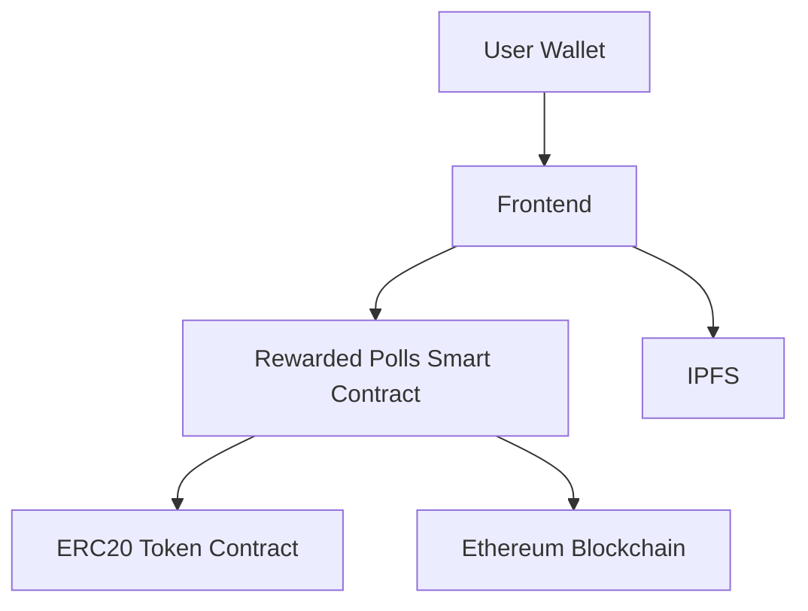

# nero-polls

```mermaid
graph TD
    A[User Wallet] --> B[Frontend]
    B --> C[Rewarded Polls Smart Contract]
    C --> D[ERC20 Token Contract]
    C --> E[Ethereum Blockchain]
    B --> F[IPFS]
```
