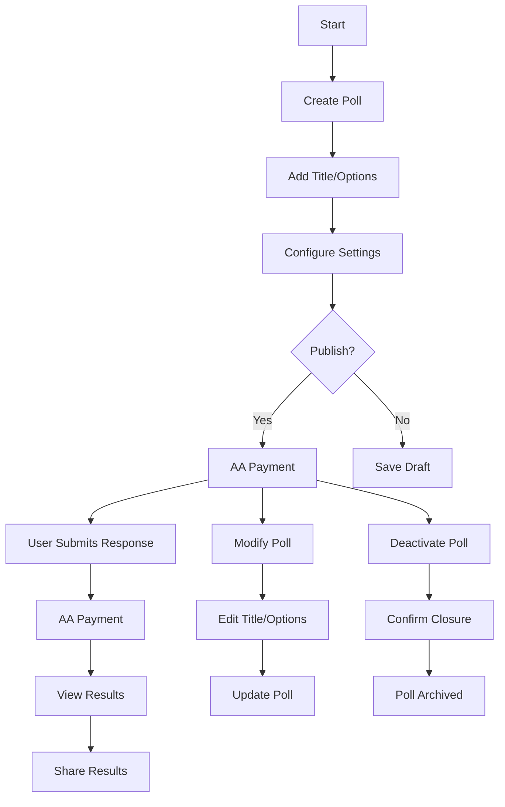

# Nero dPolls

Link to official documentation: [https://blurtopian.gitbook.io/dpolls](https://blurtopian.gitbook.io/dpolls)

* [Roadmap](./#roadmap)
* [System Architecture](./#system-architecture)
* [User Journey](./#user-journey)
* [Prototype](./#prototype)

## Roadmap

Moved to https://github.com/eastmaels/nero-polls-dapp/tree/main

## Live Demo

https://dpolls.vercel.app/

## System Architecture

## User Journey

