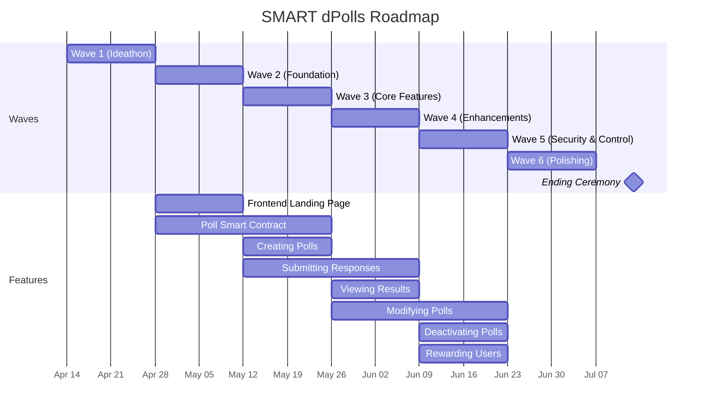
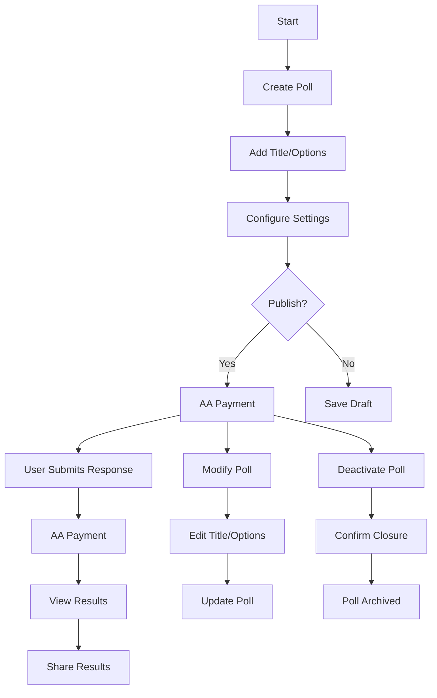

# nero-polls

* [Roadmap](#roadmap)
* [System Architecture](#system-architecture)
* [User Journey](#user-journey)
* [Prototype](#prototype)

## Roadmap

## System Architecture

## User Journey

## Prototype

https://www.figma.com/proto/5kgnPOEZCDkss8t60HpXC0/SMART-dPolls?node-id=218-354&p=f&t=891hx8VhFi0ch2L4-1&scaling=min-zoom&content-scaling=fixed&page-id=212%3A225&starting-point-node-id=218%3A242
